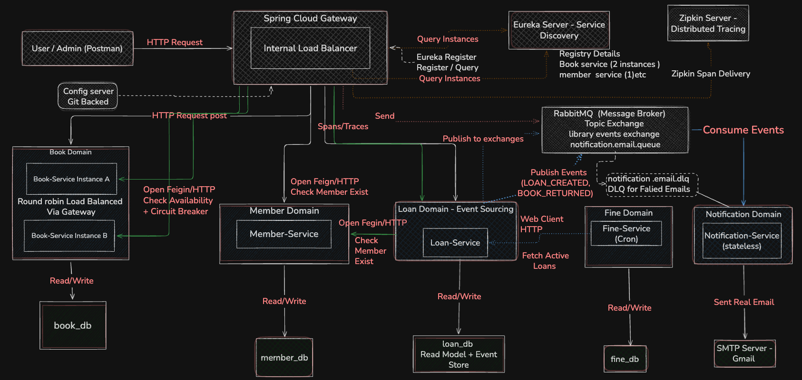

# Library Management System — Microservices Architecture

A distributed Library Management System built with Spring Boot and **Spring Cloud**, demonstrating backend engineering practices including microservices architecture, inter-service communication, event sourcing, distributed tracing, and containerized deployment.

---

---

## Tech Stack

| Component | Technology |
|---|---|
| Language | Java 21 |
| Framework | Spring Boot 3.2.5 |
| Cloud | Spring Cloud 2023.0.1 |
| Database | MySQL 8.0 |
| Messaging | RabbitMQ 3 (Management) |
| Tracing | Micrometer + Zipkin |
| Resilience | Resilience4j |
| Service Discovery | Netflix Eureka |
| API Gateway | Spring Cloud Gateway |
| Config | Spring Cloud Config (Git-backed) |
| Containerization | Docker + Docker Compose |
| Build | Maven (multi-module) |

---

## Microservices

| Service | Port | Database | Description |
|---|---|---|---|
| Config Server | 8888 | — | Git-backed centralized configuration |
| Eureka Server | 8761 | — | Service discovery and registration |
| API Gateway | 8080 | — | Single entry point, routing, load balancing |
| Book Service | 8081, 8082 | book_db | Book catalog, 2 instances for LB demo |
| Member Service | 8082 | member_db | Member profile management |
| Loan Service | 8083 | loan_db | Core transaction engine + event sourcing |
| Fine Service | 8084 | fine_db | Penalty calculation + API composition |
| Notification Service | 8085 | — | Stateless RabbitMQ consumer, email alerts |

---

## Inter-Service Communication

### OpenFeign (Synchronous)
Used when the caller needs an immediate response to proceed.
- Loan Service → Book Service (check availability)
- Loan Service → Member Service (verify member exists)
- Fine Service → Loan/Book/Member Service (aggregate for `/details`)

### WebClient (Reactive)
Used for streaming large datasets without blocking.
- Fine Service → Loan Service (stream active loans for cron job)

### RabbitMQ (Asynchronous, Event-Driven)
Used for fire-and-forget side effects.
- Loan Service publishes: `loan.book.created`, `loan.book.returned`
- Fine Service publishes: `fine.penalty.generated`
- Notification Service consumes from `notification.email.queue`
- Dead Letter Queue: `notification.email.dlq` catches failed messages

---

## Key Features

### Event Sourcing (Loan Service)
- Two tables: `loans` (read model) and `loan_events` (immutable event store)
- Events: `LOAN_CREATED`, `BOOK_RETURNED`
- Rebuild endpoint: `GET /api/v1/loans/{id}/rebuild`
    - Replays events chronologically to compute true state
    - Compares with read model
    - Auto-corrects divergence (self-healing)

### Circuit Breaker (Resilience4j)
- Protects Loan Service → Book Service calls
- Config: sliding window of 5, 50% failure threshold, 10s open duration
- Demo endpoint: `GET /api/v1/loans/simulate-failure?fail={boolean}`
- Cycle: CLOSED → OPEN (fallback) → HALF-OPEN (test) → CLOSED

### Distributed Tracing (Zipkin)
- All services instrumented with Micrometer + Brave
- Trace propagation across Feign calls and RabbitMQ messages
- Custom tags: `loanId`, `memberId`, `bookId`, `reconciliationResult`
- 100% sampling in dev (configurable via Config Server)

### Load Balancing
- 2 Book Service instances registered in Eureka
- Gateway round-robins via `lb://book-service`
- `servedByInstance` field in response proves distribution

### Global Exception Handling
- `@RestControllerAdvice` in every service
- Consistent JSON error responses with timestamp, status, error, message, path
- Specific handlers for: `ResourceNotFoundException` (404), `IllegalStateException` (400), `FeignException` (503), `WebClientResponseException` (503), `AmqpException` (503), `CompletionException` (unwraps parallel call failures)

### Dead Letter Queue
- Failed messages routed to `notification.email.dlq` via dead letter exchange
- Messages preserved with metadata (reason, original queue, count)
- Admin can inspect and republish from RabbitMQ dashboard

---

## API Documentation

### Public APIs (via Gateway at port 8080)

| Method | Endpoint | Description |
|---|---|---|
| POST | `/api/v1/loans` | Borrow a book |
| PUT | `/api/v1/loans/{id}/return` | Return a book |
| GET | `/api/v1/loans/{id}/rebuild` | Rebuild loan state (event sourcing) |
| GET | `/api/v1/loans/simulate-failure?fail={bool}` | Circuit breaker demo |
| GET | `/api/v1/fines/{id}/details` | Aggregated fine details |
| POST | `/api/v1/fines/calculate` | Trigger fine calculation |

### Internal APIs (called between services)

| Method | Endpoint | Called By |
|---|---|---|
| GET | `/api/v1/internal/books/{id}` | Loan Service, Fine Service |
| PUT | `/api/v1/internal/books/{id}/availability` | Loan Service |
| GET | `/api/v1/internal/members/{id}` | Loan Service, Fine Service |
| GET | `/api/v1/internal/loans/{id}` | Fine Service |
| GET | `/api/v1/internal/loans/active` | Fine Service (WebClient) |

---

## Setup Instructions

### Prerequisites
- Java 21 (Eclipse Temurin recommended)
- Docker Desktop
- Maven 3.9+

### Quick Start (Docker — Single Command)

```bash
# 1. Clone the repository
git clone https://github.com/DISHANK-PATEL/Library-Management-System-using-Microservices-Architecture.git
cd Library-Management-System-using-Microservices-Architecture

# 2. Set Java 21 for Maven
export JAVA_HOME=$(/usr/libexec/java_home -v 21)

# 3. Build all JARs
mvn clean package -DskipTests

# 4. Start everything
docker compose up --build -d
```

Wait ~60 seconds for all services to start and register.

### Verify Setup

```bash
# Check all containers
docker compose ps

# Check Eureka dashboard
open http://localhost:8761

# Test API
curl http://localhost:8080/api/v1/internal/books/1
```

### Monitoring Dashboards

| Dashboard | URL | Credentials |
|---|---|---|
| Eureka | http://localhost:8761 | — |
| Zipkin | http://localhost:9411 | — |
| RabbitMQ | http://localhost:15672 | admin / admin |
| Config Server | http://localhost:8888/book-service/default | — |

---

## Startup Dependency Chain

```
Layer 1: MySQL + RabbitMQ (no dependencies)
    ↓ healthy
Layer 2: Zipkin (depends on RabbitMQ)
    ↓
Layer 3: Config Server (depends on MySQL + RabbitMQ)
    ↓ healthy
Layer 4: Eureka Server (depends on Config Server)
    ↓ healthy
Layer 5: API Gateway + all business services (depend on Eureka)
```

Enforced via Docker Compose `depends_on` with `condition: service_healthy`.

---

---

## Project Structure

```
library-management-system/
├── pom.xml                          # Parent POM
├── docker-compose.yml               # Full orchestration
├── docker/
│   └── init.sql                     # MySQL schema init
├── config-repo/                     # Git-backed configs
│   ├── book-service.yml
│   ├── member-service.yml
│   ├── loan-service.yml
│   ├── fine-service.yml
│   ├── notification-service.yml
│   ├── eureka-server.yml
│   └── api-gateway.yml
├── config-server/                   # Spring Cloud Config
├── eureka-server/                   # Netflix Eureka
├── api-gateway/                     # Spring Cloud Gateway
├── book-service/                    # Book catalog
├── member-service/                  # Member profiles
├── loan-service/                    # Core engine + event sourcing
├── fine-service/                    # Penalty + aggregation
├── notification-service/            # RabbitMQ consumer + email
└── Library-Management-System.postman_collection.json
```

Each service follows layered architecture:
```
service/
├── Dockerfile
├── pom.xml
└── src/main/java/com/library/{service}/
    ├── {Service}Application.java
    ├── controller/
    ├── service/
    ├── repository/
    ├── entity/
    ├── dto/
    ├── mapper/
    ├── client/          # Feign clients (Loan, Fine)
    ├── config/          # RabbitMQ, WebClient, Tracing
    └── exception/       # Global exception handling
```

---

## Assumptions & Constraints

1. **Security**: Authentication and authorization are out of scope for this phase.
2. **Event Sourcing**: Limited to Loan Service state transitions only.
3. **Database**: Single MySQL container hosts all schemas (separate schemas per service).
4. **Fine Calculation**: Triggered by scheduled cron job, not real-time.
5. **Email**: Gmail SMTP — falls to Dead Letter Queue on connection failure.
